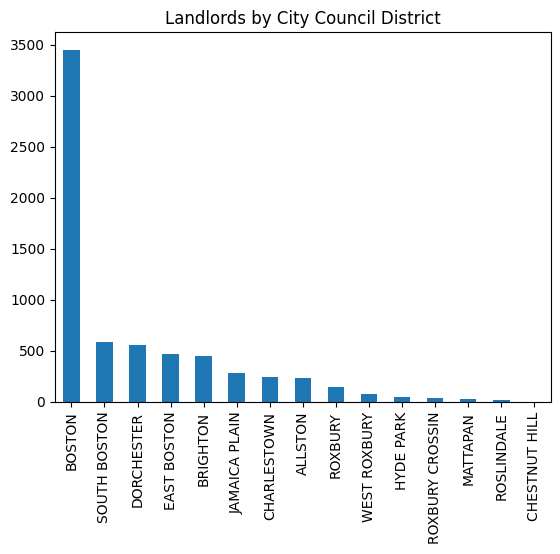

# Deliverable 1

## CS 506 City Council - Councilor Louijeune Small Landlord Project

### Dominic Maglione, Daniel Melchor, Anderson Xia, Nina Athma

---

## Requirements

Sufficient data should have been collected to perform a preliminary analysis of the data and attempt to answer one question relevant to your project proposal which you will submit as a pull request. If data has already been collected for your project you must answer two questions.

### Checklist

1. Collect and pre-process a preliminary batch of data
2. Perform a preliminary analysis of the data
3. Answer one key question
4. Refine project scope and list of limitations with data and potential risks of achieving project goal
5. Submit a PR with the above report and modifications to original proposal

## Data Pre-Processing

### Cleaning the Data

Before beginning any sort of analysis, we pre-processed (cleaned) the provided data from both the Property Assessment and Income-Restricted Housing databases. This process was completed in two separate files.

[`1_preprocess_all.ipynb`](../src/1_preprocess_all.ipynb)

[`1_preprocess_income_restricted.ipynb`](../src/1_preprocess_income_restricted.ipynb)

The pre-processed (clean) data can be viewed under the `clean` [directory](../data/clean).

### Overlaying the Data

After cleaning the data, as specified above, we loaded the cleaned datasets to create an overlay. Any limitations found while overlaying the data are addressed further below under _Data Limitations_. This process was completed in a singular file.

[2_overlay.ipynb](../src/2_overlay.ipynb)

The overlaid (joined) data can be viewed under the `clean` [directory](../data/clean).

## Two Key Questions

### What is the breakdown of landlords (in percent) listed under current affordable housing programs?

We analyzed the data to determine which landlords provide the most (quantity) affordable housing as listed by our overlaid dataset. Below is a table containing our results accompanied by a pie chart to display the breakdown by percentage.

Please note, only the top 10 landlords are displayed to avoid clutter. The process was completed in the following file.

[`3_questions.ipynb`](../src/3_questions.ipynb)

Below is a table containing specific numerical data.

| LANDLORD | NUMBER OF UNITS |
| -------- | --------------- |
| Trustees of Boston College | 185|
| Buckminster Hotel Corp | 132 |
| City of Boston | 109 |
| 121 Portland LLC | 37 |
| 420 West Broadway Condominium Trust | 36 |
| Fenway Apartments LLC Mass LLC | 32 |
| Putnam 234 Associates LLC Mass LLC | 20 |
| Mass Bay Transportation Auth | 15 |
| Charlestown Properties LLC | 14 |
| City of Boston By FCL | 13 |

From the data, we can observe the top 3 landlords that provide affordable housing are the Trustees of Boston College, Buckminster Hotel Corp, and City of Boston. Interestingly, the Trustees of Boston College are listed as providing the largest quantity of affordable housing units.

Since this particular landlord is a University, it could be argued these units are specifically for the use of students, and therefore would not assist in our project goal.

This analysis provides us a new question. What units listed under "Affordable Housing" are really intended for the general market, or specifically reserved for certain groups of individuals?

### What is the geographic distribution of these landlords by city council district?

We analyzed the data to determine the quantity of landlords by city council district as listed by our overlaid dataset. Below is a table containing our results accompanied by a bar chart to display the breakdown by quantity.

Unlike the prior question, there was no limit placed on the quantity of districts displayed, as that quantity is already defined. The process was completed in the following file.

[`3_questions.ipynb`](../src/3_questions.ipynb)

| CITY COUNCIL DISTRICT | NUMBER OF LANDLORDS |
| ---- | ---- |
| Boston | 3451 |
| South Boston | 582 |
| Dorchester | 555 |
| East Boston | 473 |
| Brighton | 444 |
| Jamaica Plain | 279 |
| Charlestown | 245 |
| Allston | 237 |
| Roxbury |  144 |
| West Roxbury | 81 |
| Hyde Park | 45 |
| Roxbury Crossing | 36 |
| Mattapan | 32 |
| Roslindale | 22 |
| Chestnut Hill | 2 |

From the data we can observe Boston clearly contains the most landlords that offer affordable housing by a very wide margin.

Interestingly, the largest landlord as observed above is the Trustees of Boston College, yet Chestnut Hill has the lowest number of landlords that offer affordable housing.

This draws into question the impact of each landlord versus the sheer quantity of units they provide. In other words, while Boston has the largest amount of landlords, it doesn't have the largest landlords to impact ratio. It could be very beneficial to our goal to potentially determine and plot this ratio.

## Project Scope

As of right now, the project scope remains unchanged from what was originally discussed with the client.

> Create a pathway for owner-occupied and small landlords (rather than commercial landlords) that could be added to a database of affordable housing units available to tenants qualified for affordable rental housing.

## Data Limitations

We encountered one primary data limitation throughout our analysis. Between the two databases there are some missing data. For example, 49 of the income-restricted projects are on Washington Street, with each having a different unit number. However, in the `Property Assessment DB` many of the entries for Washington Street do not provide a unit number.

Therefore, when we perform a `join` there are two potential outcomes,

- All of the units listed on Washington Street simply disappear.
- The resulting join is approximately 500k rows since every property assessment on Washington Street joins with 49 rows from the `Income-Restricted Housing DB`.

## Potential Risks of Achieving Project Goal

A potential risk of achieving our above specified project goal would be a lack of accurate data. As outlined in our _Data Limitations_, some income-restricted housing projects do not provide data that accurately matches up with the Boston City Council's `Property Assessment DB`.
