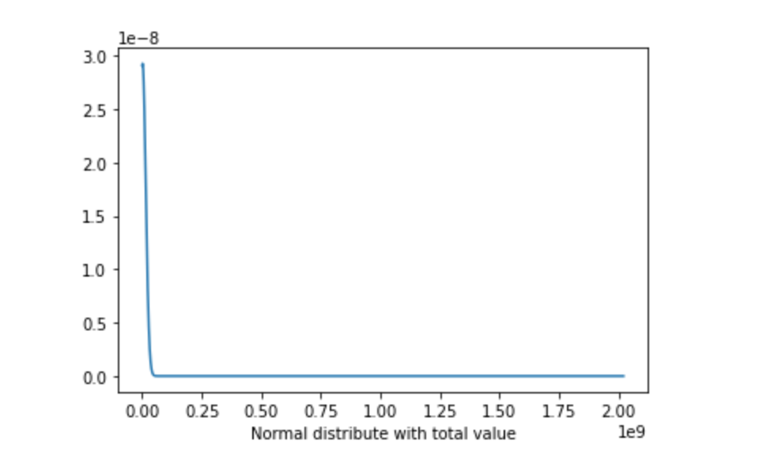

## Landlord Mapping (Small Landlord Data Analysis)

---

## Deliverable1

Shun Yao 

Yuesi Liu

Haoran Yang

Hanlin Zou

---

During this period, we sorted out all the documents and data sets needed for this project, read the definition document of the data set, and understood the meaning behind the data. Then, we removed unnecessary and unusable data. Next, we drew some graphs based on the data we had, to understand the distribution of the data and what was unusual behind the data.

For example, the values of houses are not well distributed. We felt that having a general sense of direction on the project's data would help us move forward on the right path before we started in-depth analysis.

---

We answered the question how many units there are and classified the units according to their types.

---

In the next step, we will analyze the data more deeply and grasp the key characteristics of the data to get more answers. At the same time, given a complete solution, where might the potential affordable house appear.